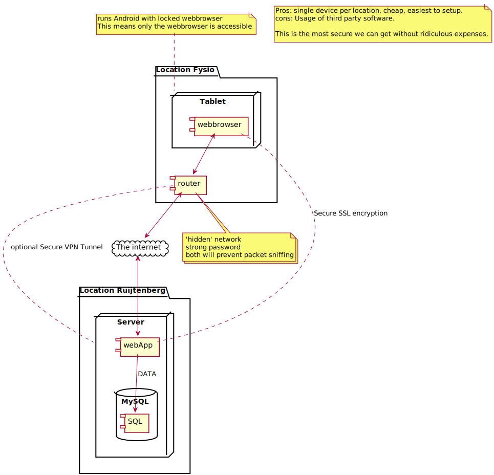

#implementation plan

This document describes the network implementation plan for the network of the fysio feedback system. 

## Tablet Configuration

The tablet must be a cheap tablet with the minimum functionality of a browser. We will install an [kiosk browser solution for android](www.android-kiosk.com) on it. 
We still need to see investigate and test which tablet would be most feasible. The proposed tablet needs to be

- Cheap
- Highly available on the market
- fast enough to run a basic browser 

## Router Configuration

I would recommend an router from [gl-inet.com](https://www.gl-inet.com/), which you can purchase for 20$ from eBay. It is highly configurable. And supports all our requirements. Included but not limited to hidden networks, configurable firewalls, VPN encryption and macaddress whitelisting. 

## Server Configuration

For security, it is vital that the information is encrypted while in-transit. 
This can be done in 2 ways:

- SSL encryption using a free [lets-encrypt certificate](https://letsencrypt.org/)
- VPN tunnel to the server, this might be necessary if the web-application does not support encryption properly. The router should be able to take care of this. 
