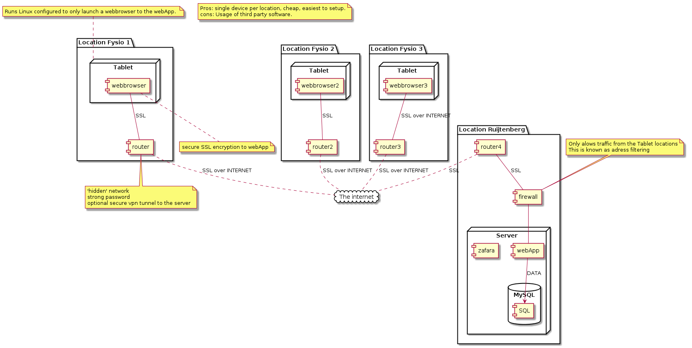

#implementation plan

This document describes the network implementation plan for the network of the fysio feedback system. 

## Tablet Configuration

The tablet must be a tablet with the minimum functionality of a browser. 
We still need to see investigate and test which tablet would be most feasible. The proposed tablet needs to be:

- Highly available on the market
- Fast enough to run a basic browser 
- Fully compatible with a opensource operating system. Most likely Linux. 

If no suitable tablet can be found, we will propose to replicate the same functionality with an touchscreen or touchscreen/PC combination. 

## Router Configuration

I would recommend an router from [gl-inet.com](https://www.gl-inet.com/), which you can purchase for 20$ from eBay. It is highly configurable. And supports all our requirements. Included but not limited to hidden networks, configurable firewalls, VPN encryption and macaddress whitelisting. On top of that, it's firmware is fully opensource, with the exeption of a browser-based GUI configuration tool, but that does not interfere with the information integrity and security. 

## Firewall configuration

The firewall will filter out request from uknown locations. (Whitelisting) 
We can use an UniFy Security Gateway for this, which cost around 130 euro. Or configure a cheaper machine to do this for us. Investigations will show us which way we need to go. 

## Server Configuration

For security, it is vital that the information is encrypted while in-transit. 
This can be done in 2 ways:

- SSL encryption using a free [lets-encrypt certificate](https://letsencrypt.org/)

The server will run Apache2 with strict-ssl enabled. This means that the server will stop serving the application if the encryption is somehow disabled. 
